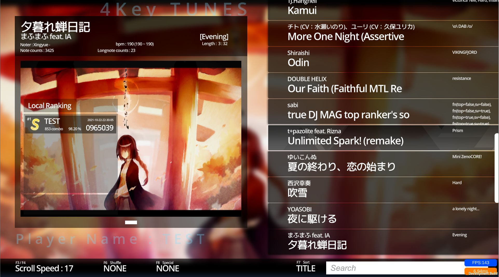
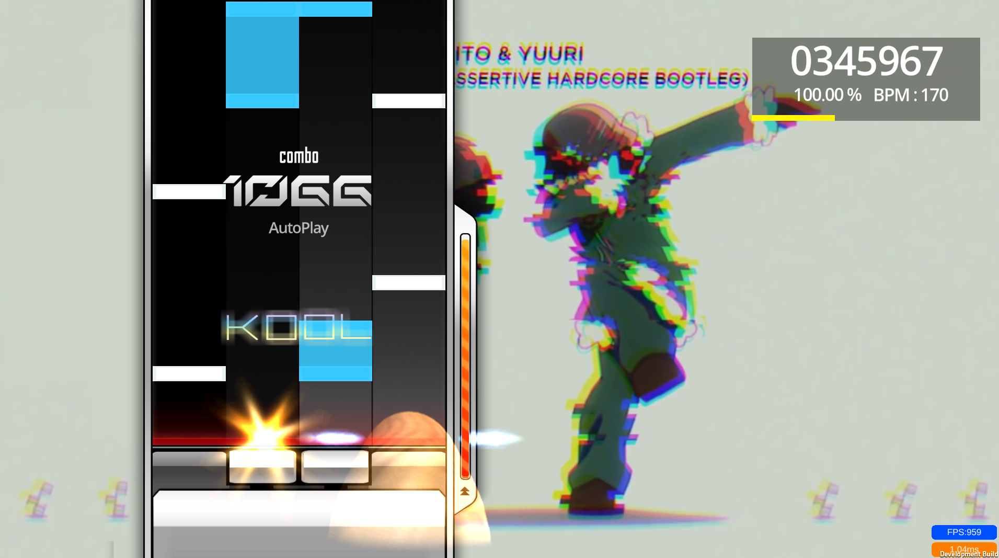
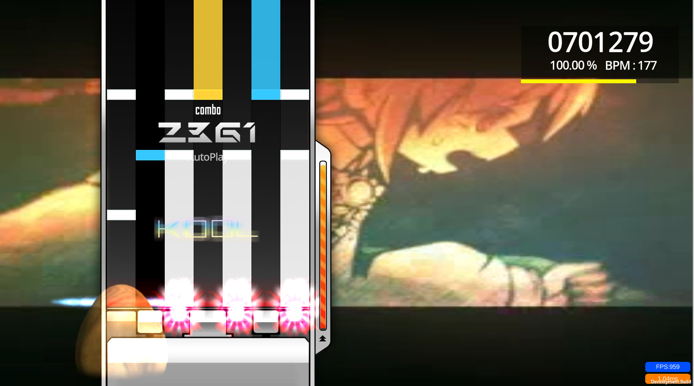

# Rhythm Game Algorhythm for C#/Unity using FMOD

Screenshot:

Play Movie :

(4K) Aleph-0 BPM Gimmick/Performance TEST
https://youtu.be/8WU6fJInv2w

Re:End of a dream (bms)
(https://www.youtube.com/watch?v=pEQQA-aenLM)

Say a Vengeance (bms)
(https://youtu.be/Q5IbDTs_AnY)

Identity part II (o2jam)
(https://youtu.be/_KSjgk9VNLs)

## FMOD Coresystem API

It can play 200++ keysounds at one time
https://fmod.com/resources/documentation-api?version=2.0&page=core-api-system.html

## Local / Online Ranking

Local Ranking is using Json.net
Online Ranking uses PHP (Laravel)

## osu! file format

In setting(F10), select "Songs" folder in osu! install location.
or download songs from https://osu.ppy.sh/ and unzip in specific folder and select.
Supports 4K / 7K 

## Game Modes

4K/7K
Supports Random/Mirror
Supports Judgeline offset, column width, sync adjustment
Supports Longnote readability improvement function
Supports Autoplay

## Two Input Systems (2021/11/19 add)

Raycast Input systems -> for mobile
Using Collections -> for PC, better performance.
It can toggled on Playmusic scene > Notereader's NewInputSys boolean

2021/11/19 : fix score bug

This project is licensed under the terms of the MIT license.

